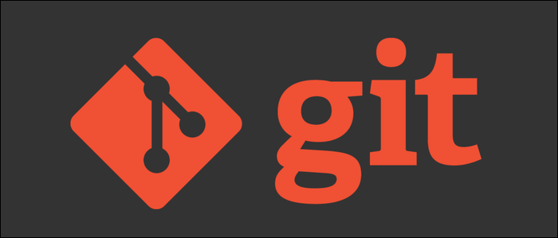

# Инструкция по работе с Git

_Первое, что нужно сделать после установки программы — указать ваше имя и адрес электронной почты с помощью следующих команд:_

1. `git config --global user.name "Ваше имя на латинице"`
2. `git config --global user.email "your_email@example.com"`

## Команды Git

До начала работы необходимо проверить текущую установленную версию программы. Для этого в терминале вводим команду: 

`git --version` *(если Git установлен на компьютер, вы увидите его текущую версию).*

### Создание Git-репозитория:
* Инициализация локального каталога, который еще не находится под версионным контролем, и превращение его в репозиторий.
* Клонирование существующего репозитория из удаленного источника.

**Команда `git init`**
* Позволяет указать папку, в которой Git начнёт отслеживать изменения.
* Создает скрытую директорию `.git` внутри проекта.

**Команда `git status`**
* Показывает текущее состояние репозитория: есть ли изменения, которые необходимо сохранить.

> Чтобы вызвать ранее введенную команду, можно использовать стрелку **«Вверх»** на клавиатуре. Это позволит не вводить команду заново, а выбрать её из списка недавних действий.

**Команда `git add <имя_файла>`**
* Добавляет один конкретный файл в индекс для последующего коммита.
* После команды необходимо ввести имя файла и его расширение. Писать название полностью необязательно: можно ввести первые несколько символов, а затем нажать кнопку **Tab** на клавиатуре — данные дозаполнятся автоматически. 

**Команда `git add .`**
* Добавляет все измененные и новые файлы проекта для последующего коммита. В этом случае не нужно прописывать имя каждого файла отдельно.

**Команда `git commit`**
* Используется для фиксации текущего статуса. Она берет все данные, добавленные в индекс с помощью команды `git add`.
* Флаг `-m "комментарий"` позволяет сразу указать в сообщении, какое именно действие было совершено на данном этапе. Например: `git commit -m "Добавили информацию о командах Git"`.

> Для сохранения изменений без предварительного вызова команды `git add`, можно использовать команду `git commit -am "комментарий"`. Это позволит сократить количество выполняемых действий для уже отслеживаемых файлов.

**Команда `git log`**
* Выводит на экран журнал изменений в хронологическом порядке с указанием хэша коммита, автора, даты и прикрепленного сообщения.
> Чтобы выйти из журнала изменений в исходное окно терминала, необходимо нажать клавишу **Q**.

**Команда `git checkout`**
* Используется для переключения между версиями проекта. Для этого достаточно ввести первые 4 символа из хэша коммита, в который вы хотите перейти.
* Чтобы вернуться в актуальную версию (на острие ветки) после переходов, необходимо ввести команду `git checkout master` (или `main`).

**Команда `git diff`**
* Показывает разницу между текущим состоянием файла и его последней сохраненной версией.

**Команда `git reflog`**
* Выводит на экран полный журнал всех совершенных действий и перемещений, включая удаленные коммиты.
